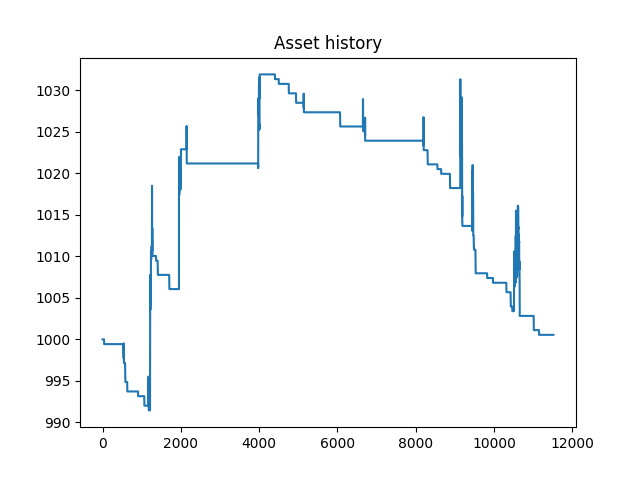
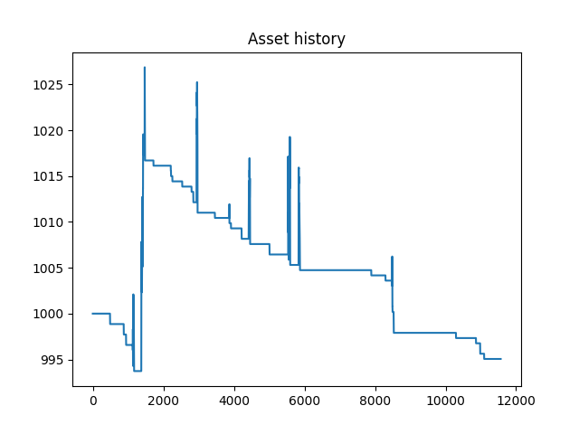
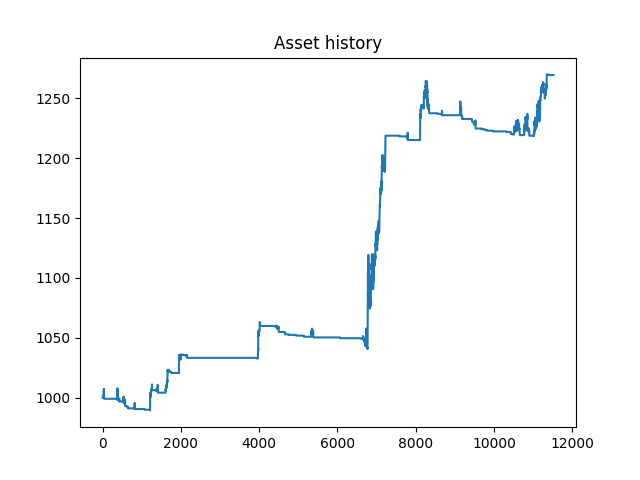
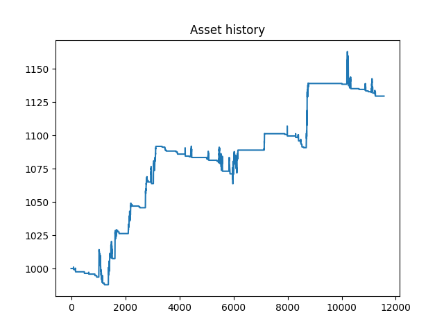

# OneStepAhead

## Abstraction
This project applies machine learning to predict the future trend in the VN30 Futures Index, making it actively following the trend without lagging behind like other common momentum strategies. The backtest results show promising performance.


## Introduction
The futures market has high votility, resulting in high returns and also huge risk. Common momentum strategies rely on indicators to make decisions. However, as indicators only reflect past states based on past data, they often late to the trend.

With the raise of machine learning in many fields, particularly in time-series forecasting, we are motivated to utilize it for solving the lagging problem of momentum strategies. 


## Trading (Algorithm) Hypotheses
Prediction model: a customized Time Series Transformer model.

- Context length: 700 tokens (5 mins interval/token -> ~14 trading days).
- Prediction length: 50 tokens (5 mins interval/token -> ~1 trading day).
- Input features: 
    + OHLCV of VN30 and VN30F1M
    + Time features: time of day, day of year, days until next expiration.
- <s>Output features: H and L of VN30F1M</s>
- Output: A Student's t-distribution for each value.

For each predicted series, open at most 1 position, only 1 contract per position. 

Unlimited holdings, as long as $AR < 70\%$.

### Naive algorithm
Let $H$ be the list of means of the distributions for High prices, and
$L$ be the list of means of the distributions for Low prices. We have:

$\text{maxima} = \arg\max_{i}H[i]$

$\text{minima} = \arg\min_{i}L[i]$

$\text{maximum} = H[maxima]$

$\text{minimum} = L[minima]$

```python
if maximum - minimum > FEE: 
# Fee, by default, is 0.47 per closed position

    if minima < maxima:
        pos_type = "LONG"
        entry_point = minimum
        take_profit_point = maximum
        stop_loss_point = minimum - 0.1
    elif maxima < minima:
        pos_type = "SHORT"
        entry_point = maximum
        take_profit_point = minimum
        stop_loss_point = maximum + 0.1
```

## Data
### Data Collection
- OHLCV of VN30 and VN30F1M
- Interval: 1-minute
- Source: SSI FastConnect API
- Range: 20/12/2019 - 16/01/2025

### Data Processing
- Align records of VN30 and VN30F1M by trading time
- Merge records in a day into 5-minutes intervals.
- For each record, add:
    - time of day
    - day of year
    - days until next expiration
- Split:
    - 60% for model training
    - 20% for model validation and in-sample backtesting
    - 20% for model testing and out-of-sample backtesting

## Implementation

### Note: Reproducibility
The results in this document were produced on an Nvidia RTX 3080Ti. 
We also provide the results on an CPU-only device with an Intel Core Ultra 7 265K at `./results_cpu`.

Set a debug environment variable to ensure reproducibility on CUDA device:

```shell
export CUBLAS_WORKSPACE_CONFIG=:4096:8 # for Linux

set CUBLAS_WORKSPACE_CONFIG=:4096:8 # for Windows command line
$env:CUBLAS_WORKSPACE_CONFIG = ":4096:8" # for Windows PowerShell
```

### Setup Environment
Create and activate virtual environment:
```shell
python3 -m venv .venv
source .venv/bin/activate # for Linux/MacOS
.\venv\Scripts\activate.bat # for Windows command line
.\venv\Scripts\Activate.ps1 # for Windows PowerShell
which python3
```

Upgrade pip:
```shell
pip3 install --upgrade pip
```

Install Pytorch:
```shell
# For Linux and Windows, CUDA
pip3 install torch==2.6.0 torchvision==0.21.0 torchaudio==2.6.0 --index-url https://download.pytorch.org/whl/cu126

# For Linux and Windows, CPU-only
pip3 install torch==2.6.0 torchvision==0.21.0 torchaudio==2.6.0 --index-url https://download.pytorch.org/whl/cpu

# For MacOS
pip install torch==2.6.0 torchvision==0.21.0 torchaudio==2.6.0
```

Install other dependencies:
```shell
pip3 install -r requirements.txt
```

### Data Collection and Processing
#### Option 1. Use the provided data
The processed data is available at `data/data.json`.

#### Option 2. Run script to collect and process data
Put your SSI FastConnect Data API information into `configs/fc_data_config.py`:

```python
consumerID = 'fb20f607926a447fa50c83xxxxxxxxxx'
consumerSecret = '478c1923481c48858c8b3dxxxxxxxxxx'
```

Run the script to collect and process data:

```shell
python3 collect_data.py
```
The data will be stored in `data/data.json`.


### Prediction Model
#### Option 1. Use the provided model
The trained model is available at `model_checkpoint/checkpoint.pt`.

#### Option 2. Run script to train the model
```shell
python3 train.py
```
The model will be stored at `model_checkpoint/checkpoint.pt`.


### Backtesting
Go to `configs/config.py` and set 

```python
backtest_optimized_algo = False
```

if you want to use the naive algorithm, or

```python
backtest_optimized_algo = True

optimized_algo_params = {
    "p_highs": 0.39,
    "p_lows": 0.66,
    "p_stoploss": 0.01,
    "using_dp": False
}
```

to use optimized algorithm and change it's parameters.

Run the python script for backtesting:
```shell
python3 backtest.py
```

### Optmization
In `configs/config.py`, set the **number of parallel processes**, the **total number of startup trials** and the **total number of trial**:

```python
TOTAL_PROCESSES = 8
n_startup_trials = 160
n_trials = 1600
```

Run the python script to start optimizing:
```shell
python3 optimization.py
```

### Other Configurations
```python
# trading agent configuration
BALANCE = 1000
FEE = 0.47
MARGIN_RATIO = 0.175
ASSEST_RATIO = 0.8

# where the output results from backtest and optimization go
results_dir = "./results" 
```


## Backtesting with Naive Algorithm
### In-sample

|  **ROI** | **Trades** | **Win rate** |  **MDD**  | **Sharpe ratio** |
|:--------:|:----------:|:------------:|:---------:|:----------------:|
|  0.05% |    88    |    3.41%   | -3.04% |      -1.03      |



### Out-of-sample

|  **ROI** | **Trades** | **Win rate** |  **MDD**  | **Sharpe ratio** |
|:--------:|:----------:|:------------:|:---------:|:----------------:|
| -0.49% |    55    |    1.82%   | -3.10% |      -1.09    |



## Optmization

### Dynamic Programming
Let $f(j, i)$ be the returns of one best trade we can make on the predicted prices, from time $j$ to time $i$ (inclusively), using the Naive algorithm.

Let $dp(i)$ be the best returns we can make from time $0$ to time $i$ by splitting (0, i) into one or many non-overlaping intervals and run Naive algorithm on each of them. $dp(0) = 0$.

Pseudo code:
```python
for i in range(n):
    dp[i] = dp[i - 1]
    for j in range(1, i - 1):
        dp[i] = max(dp[i], dp[j - 1] + f(j, i))
```

After that, we run backtracking to get the list of trades that result in our best returns $dp(n - 1)$. However, we only use the first one, as after we complete the first trade, more new data are coming in, and we want to make a more up-to-date prediction.

### Adjust Predicted Prices with Quantiles
The model's prediction provide us with the probability distributions. We can use them to make adjustment.

For a cumulative distribution function (cdf):
$$F_X(x) := Pr(X \leq x) = p$$

We have the inverse cdf:
$$Q(p) = F^{-1}_X (p)$$

Let $H$ be the list of means of the distributions for High prices, and
$L$ be the list of means of the distributions for Low prices. We have:

$$ adjusted_H = Q_H(p_H) $$

$$ adjusted_L = Q_L(p_H) $$

And the stoploss is adjusted by:

$$ adjusted_{stoploss} = max(Q_H(p_H + p_{stoploss})) $$

in case of SHORT position, or:

$$ adjusted_{stoploss} = min(Q_L(p_L - p_{stoploss})) $$

in case of LONG position.

### Optuna
- Objective: Maximizing Sharpe ratio
- Sampler: TPESampler
- Number of startup trails: 160
- Number of trails: 1600
- Number of parallel processes: 8
- Parameters to search for:
    - $p_H$
    - $p_L$ 
    - $p_{stoploss}$
    - using_dp

### Best Parameter Set
| **Parameter** 	|      **Value**      	|
|:-------------:	|:-------------------:	|
|    $p_H$    	    |         0.39 	        |
|     $p_L$    	    |         0.66        	|
|   $p_{stoploss}$  	|         0.01         	|
|    using_dp   	|        False        	|


## Backtesting with Optimized Algorithm
### In-sample
|  **Algorithm**  |    **ROI**   | **Trades** | **Win rate** |    **MDD**    | **Sharpe ratio** |
|:---------------:|:------------:|:----------:|:------------:|:-------------:|:----------------:|
|      Naive      |  0.05% |    88    |    3.41%   | -3.04% |      -1.03      |
| **_Optimized_** | **_26.93%_** | **_139_** | **_8.63%_** | **_-4.00%_** |   **_2.57_**   |



### Out-of-sample
|  **Algorithm**  |    **ROI**   | **Trades** | **Win rate** |    **MDD**    | **Sharpe ratio** |
|:---------------:|:------------:|:----------:|:------------:|:-------------:|:----------------:|
|      Naive      | -0.49% |    55    |    1.82%   | -3.10% |      -1.09    |
| **_Optimized_** | **_12.95%_** | **_139_** | **_7.19%_** | **_-2.87%_** |    **_1.45_**    |


