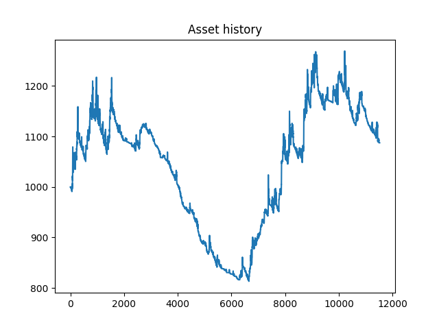
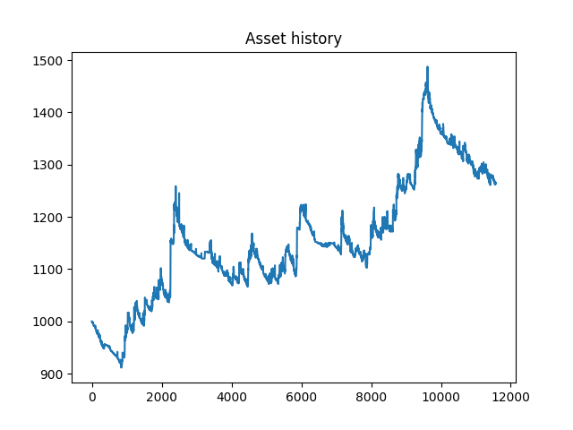
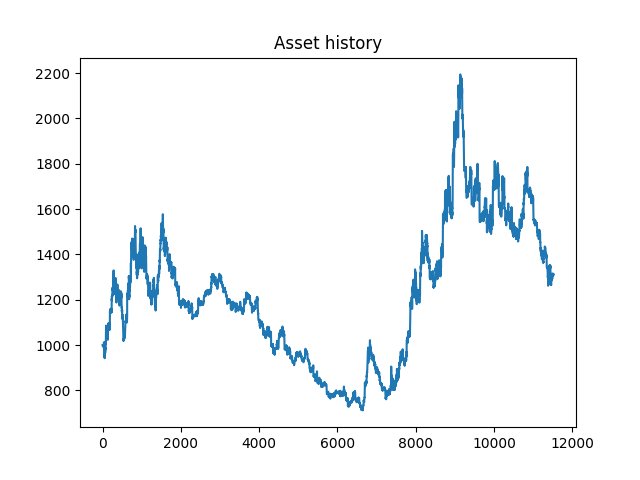
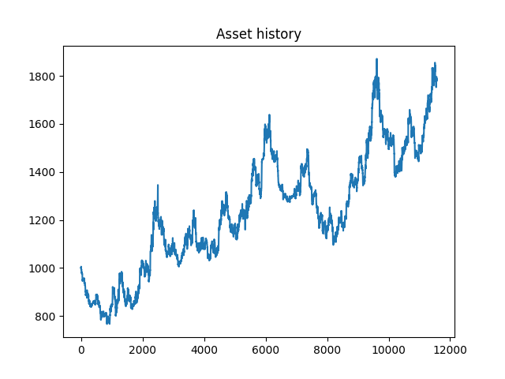

# OneStepAhead

## Abstraction

## Introduction

## Trading (Algorithm) Hypotheses
Prediction model: a customized Time Series Transformer model.

- Context length: 700 tokens (5 mins interval/token -> ~14 trading days).
- Prediction length: 50 tokens (5 mins interval/token -> ~1 trading day).
- Input features: 
    + OHLCV of VN30 and VN30F1M
    + Time features: time of day, day of year, days until next expiration.
- <s>Output features: H and L of VN30F1M</s>
- Output: A Student's t-distribution for each value.

For each predicted series, open at most 1 position, only 1 contract per position. 

Unlimited holdings, as long as $AR < 70\%$.

### Naive algorithm
Let $H$ be the list of means of the distributions for High prices, and
$L$ be the list of means of the distributions for Low prices. We have:

$\text{maxima} = \arg\max_{i}H[i]$

$\text{minima} = \arg\min_{i}L[i]$

$\text{maximum} = H[maxima]$

$\text{minimum} = L[minima]$

```python
if maximum - minimum > FEE: 
# Fee, by default, is 0.47 per closed position

    if minima < maxima:
        pos_type = "LONG"
        entry_point = minimum
        take_profit_point = maximum
        stop_loss_point = minimum - 0.1
    elif maxima < minima:
        pos_type = "SHORT"
        entry_point = maximum
        take_profit_point = minimum
        stop_loss_point = maximum + 0.1
```

## Data
### Data Collection
- OHLCV of VN30 and VN30F1M
- Interval: 1-minute
- Source: SSI FastConnect API
- Range: 20/12/2019 - 16/01/2025

### Data Processing
- Align records of VN30 and VN30F1M by trading time
- Merge records in a day into 5-minutes intervals.
- For each record, add:
    - time of day
    - day of year
    - days until next expiration
- Split:
    - 60% for model training
    - 20% for model validation and in-sample backtesting
    - 20% for model testing and out-of-sample backtesting

## Implementation

### Setup Environment
Create and activate virtual environment:
```shell
python3 -m venv venv
source venv/bin/activate # for Linux/MacOS
.\venv\Scripts\activate.bat # for Windows command line
.\venv\Scripts\Activate.ps1 # for Windows PowerShell
which python3
```

Install dependencies:
```shell
pip3 install --upgrade pip
pip3 install -r requirements.txt
```

### Data Collection and Processing
#### Option 1. Use the provided data
The processed data is available at `data/data.json`.

#### Option 2. Run script to collect and process data
Put your SSI FastConnect Data API information into `configs/fc_data_config.py`:

```python
consumerID = 'fb20f607926a447fa50c83xxxxxxxxxx'
consumerSecret = '478c1923481c48858c8b3dxxxxxxxxxx'
```

Run the script to collect and process data:

```shell
python3 collect_data.py
```
The data will be stored in `data/data.json`.


### Prediction Model
#### Option 1. Use the provided model
The trained model is available at `model_checkpoint/checkpoint.pt`.

#### Option 2. Run script to train the model
```shell
python3 train.py
```
The model will be stored at `model_checkpoint/checkpoint.pt`.


### Backtesting
Go to `configs/config.py` and set 

```python
backtest_optimized_algo = False
```

if you want to use the naive algorithm, or

```python
backtest_optimized_algo = True

optimized_algo_params = {
    "p_highs": 0.43000000000000005,
    "p_lows": 0.62,
    "p_stoploss": 0.5,
    "using_dp": False
}
```

to use optimized algorithm and change it's parameters.

Run the python script for backtesting:
```shell
python3 backtest.py
```

### Optmization
In `configs/config.py`, set the **number of parallel processes**, the **total number of startup trials** and the **total number of trial**:

```python
TOTAL_PROCESSES = 20
n_startup_trials = 100
n_trials = 1000
```

Run the python script to start optimizing:
```shell
python3 optimization.py
```

### Other Configurations
```python
# trading agent configuration
BALANCE = 1000
FEE = 0.47
MARGIN_RATIO = 0.175
ASSEST_RATIO = 0.8

# where the output results from backtest and optimization go
results_dir = "./results" 
```


## Backtesting with Naive Algorithm
### In-sample

|  **ROI** | **Trades** | **Win rate** |  **MDD**  | **Sharpe ratio** |
|:--------:|:----------:|:------------:|:---------:|:----------------:|
|  8.75% |    2545    |    3.18%   | -33.22% |      0.36      |



### Out-of-sample

|  **ROI** | **Trades** | **Win rate** |  **MDD**  | **Sharpe ratio** |
|:--------:|:----------:|:------------:|:---------:|:----------------:|
| 26.50% |    2721    |    4.89%   | -15.31% |      0.99    |



## Optmization

### Dynamic Programming
Let $f(j, i)$ be the returns of one best trade we can make on the predicted prices, from time $j$ to time $i$ (inclusively), using the Naive algorithm.

Let $dp(i)$ be the best returns we can make from time $0$ to time $i$ by splitting (0, i) into one or many non-overlaping intervals and run Naive algorithm on each of them. $dp(0) = 0$.

Pseudo code:
```python
for i in range(n):
    dp[i] = dp[i - 1]
    for j in range(1, i - 1):
        dp[i] = max(dp[i], dp[j - 1] + f(j, i))
```

After that, we run backtracking to get the list of trades that result in our best returns $dp(n - 1)$. However, we only use the first one, as after we complete the first trade, more new data are coming in, and we want to make a more up-to-date prediction.

### Adjust Predicted Prices with Quantiles
The model's prediction provide us with the probability distributions. We can use them to make adjustment.

For a cumulative distribution function (cdf):
$$F_X(x) := Pr(X \leq x) = p$$

We have the inverse cdf:
$$Q(p) = F^{-1}_X (p)$$

Let $H$ be the list of means of the distributions for High prices, and
$L$ be the list of means of the distributions for Low prices. We have:
$$\text{adjusted\_H} = Q\_H(\text{p\_H}) $$
$$\text{adjusted\_L} = Q\_L(\text{p\_L}) $$

And the stoploss is adjusted by:

$$\text{adjusted\_stoploss} = max(Q\_H(\text{p\_H + p\_stoploss})) $$

in case of SHORT position, or:

$$\text{adjusted\_stoploss} = min(Q\_L(\text{p\_L - p\_stoploss})) $$

in case of LONG position.

### Optuna
- Criterion: maximum ROI
- Sampler: SPESampler
- Number of startup trails: 100
- Number of trails: 1000
- Number of parallel processes: 20
- Parameters to search for:
    - p_H
    - p_L
    - p_stoploss
    - using_dp

### Best Parameter Set
| **Parameter** 	|      **Value**      	|
|:-------------:	|:-------------------:	|
|    p_H    	    |         0.43 	        |
|     p_L    	    |         0.62        	|
|   p_stoploss  	|         0.5         	|
|    using_dp   	|        False        	|


## Backtesting with Optimized Algorithm
### In-sample
|  **Algorithm**  |    **ROI**   | **Trades** | **Win rate** |    **MDD**    | **Sharpe ratio** |
|:---------------:|:------------:|:----------:|:------------:|:-------------:|:----------------:|
|      Naive      |     8.75%    |    2545    |     3.18%    |    -33.22%    |       0.36       |
| **_Optimized_** | **_31.33%_** | **_2485_** | **_50.78%_** | **_-54.87%_** |   **_0.7150_**   |



### Out-of-sample
|  **Algorithm**  |    **ROI**   | **Trades** | **Win rate** |    **MDD**    | **Sharpe ratio** |
|:---------------:|:------------:|:----------:|:------------:|:-------------:|:----------------:|
|      Naive      |    26.50%    |    2721    |     4.89%    |    -15.31%    |       0.99       |
| **_Optimized_** | **_78.38%_** | **_2678_** | **_53.51%_** | **_-33.13%_** |    **_1.27_**    |


